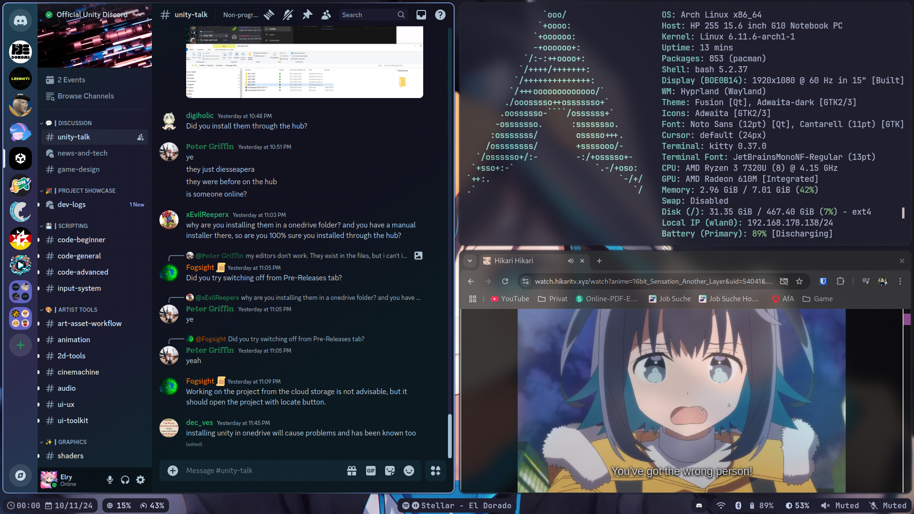

# Elry's Hyprland Dotfiles 
Welcome to my Hyprland Guide! </br>
This repository is designed to copy up my Hyprland environment on Arch. </br>
By the end of this guide, you'll have a clean Hyprland setup like this: </br>
 </br>
And also a nice SDDM & Grub Theme: </br>


## Installation

1. Clone the repository to your home folder:
    ```
    git clone https://github.com/ElryGH/dotfiles.git
    ```
2. Navigate to the installer directory:
    ```
    cd ~/dotfiles/scripts/installer
    ```
3. Run the installation script with sudo:
    ```
    sudo sh install.sh
    ```
4. Use the Installation Script to set up Hyprland.

### Key Bindings

After installation, you'll want to familiarize yourself with the default key bindings. </br>
Here are some essential shortcuts to get you started:

#### General
- `Super + T`: Open the terminal (Kitty).
- `Super + C`: Open the browser (Chrome).
- `Super + F`: Open the file manager (Nautilus).
- `Super + R`: Open the application menu (Tofi).
- `Super + N`: Open the application menu (Obsidian).

#### Window Management & Workspace Navigation
- `Super + Q`: Close the active window.
- `Super + W`: Toggle floating mode for the active window.
- `Super + G`: Toggle Group
- `Super + J`: Toggle split mode in the Dwindle layout.
- `Super + S`: Show/Hide the Special Workspace.
- `Super + Alt + S`: Move to Special Workspace.

#### Screen Brightness, Volume and Media Control
- `Brightness Up`: Increase the screen brightness by 5%.
- `Brightness Down`: Decrease the screen brightness by 5%.
- `Volume Up`: Increase the volume by 5%.
- `Volume Down`: Decrease the volume by 5%.
- `Mic Mute`: Mute the microphone.
- `Audio Mute`: Mute the audio.
- `Play/Pause`: Toggle play/pause for media.
- `Next Track`: Skip to the next track.
- `Previous Track`: Go back to the previous track.

#### Miscellaneous
- `SUPER + L`: Lock screen
- `Super + V`: Open the clipboard history and paste the selected item.
- `Super + P`: Open the color picker and copy the selected color to the clipboard.
- `Super + L`: Lock the screen.
- `Super + Escape`: Open the logout menu.
- `Print Screen`: Take a screenshot of the entire screen and copy it to the clipboard.

Make sure to have applications installed corresponding to the binds. </br>
Feel free to customize these keybindings to better suit your needs.

## Credits
* [Simple Hyprland](https://github.com/gaurav210233/simple-hyprland)
* [SDDM Chili](https://github.com/MarianArlt/sddm-chili)
* [Arch Silence](https://github.com/fghibellini/arch-silence)
* [Archchan Wallpaper](https://www.pixiv.net/en/artworks/103383813)
